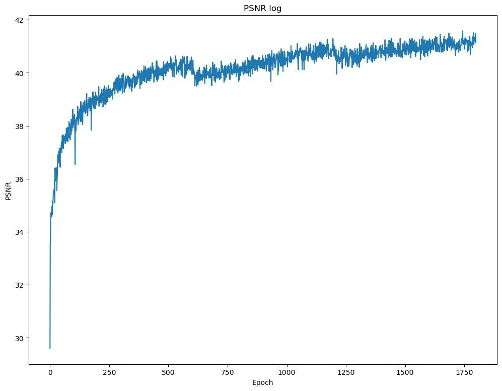
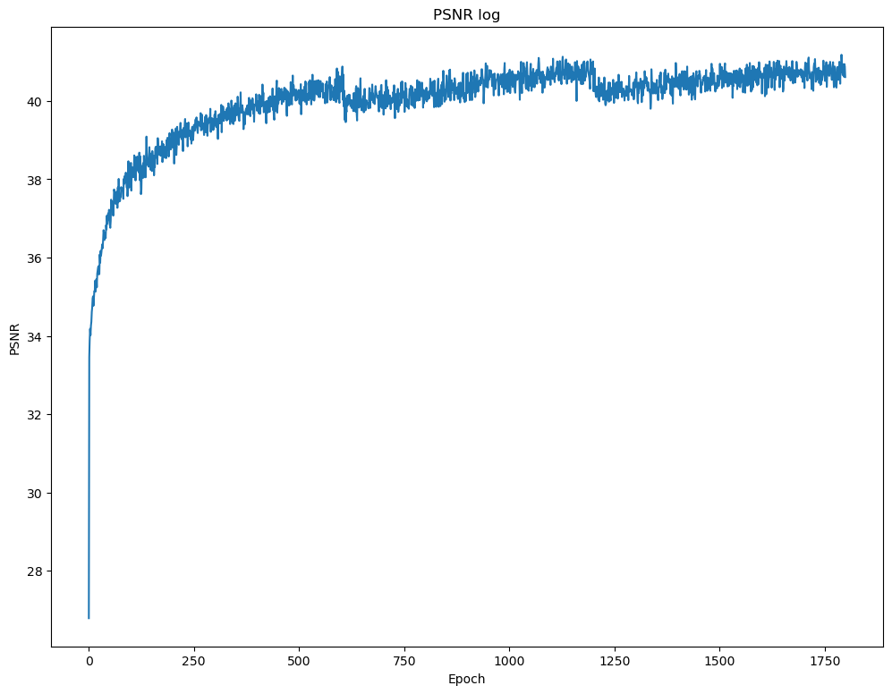
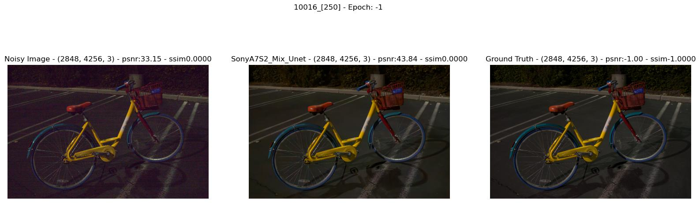

# 人工智能实践课大作业：PMN-Jittor

> 论文复现和迁移项目：主题为 **RAW 域低光照图像去噪**。项目将 PMN 的核心训练与评估流程迁移到 Jittor，并在 SID / ELD 数据集上完成复现实验。


## 项目亮点

- 基于 Jittor 复现 PMN 的 RAW 域去噪训练、评估和测试流程。
- 支持 SID 与 ELD 数据集，包含 info 文件生成、训练、评估、可视化输出等完整脚本。
- 提供与原 PyTorch 实现对齐的 PSNR / SSIM 结果记录。
- 已整理 CLI、依赖清单、忽略规则和结果曲线绘制脚本，方便在新环境中复现实验。

## 结果预览

| 原 PyTorch PSNR 曲线 | Jittor 复现 PSNR 曲线 |
| :---: | :---: |
|  |  |

| 可视化对比 |
| :---: |
|  |

## 目录结构

```text
PMN-jittor/
├── archs/                 # UNet 与网络模块
├── data_process/          # RAW 数据读取、合成噪声、数据集定义
├── runfiles/              # 训练与评估配置
├── scripts/               # 辅助脚本，例如曲线绘制
├── infos/                 # 数据集索引文件
├── trainer_SID.py         # SID / ELD 训练与评估入口
├── get_dataset_infos.py   # 生成数据集 info 文件
├── base_trainer.py        # 通用训练器、CLI 与学习率调度
├── losses.py              # 损失函数与 PSNR 计算
└── utils.py               # 日志、指标、RAW/RGB 转换与绘图工具
```

## 环境配置

推荐环境：

- Python >= 3.7
- Jittor >= 1.3
- Ubuntu 24.04
- CUDA 12.0

安装依赖：

```bash
pip install -r requirements.txt
```

CPU 环境可以运行基础流程，但 RAW 去噪训练耗时较长，建议使用 GPU。

## 数据准备

请下载并解压 SID 与 ELD 数据集：

| 数据集 | 链接 | 说明 |
| --- | --- | --- |
| ELD | [官方仓库](https://github.com/Vandermode/ELD) / [下载](https://drive.google.com/file/d/13Ge6-FY9RMPrvGiPvw7O4KS3LNfUXqEX/view?usp=sharing) | 约 11.46 GB |
| SID | [官方仓库](https://github.com/cchen156/Learning-to-See-in-the-Dark) / [下载](https://storage.googleapis.com/isl-datasets/SID/Sony.zip) | 约 25 GB |

建议目录：

```text
datasets/
├── ELD/
│   └── SonyA7S2/
└── SID/
    └── Sony/
        ├── long/
        └── short/
```

可以通过环境变量或命令行参数指定数据目录：

```bash
export PMN_SID_ROOT=/path/to/SID/Sony
export PMN_ELD_ROOT=/path/to/ELD
```

## 生成数据索引

```bash
# ELD 评估索引
python get_dataset_infos.py --dstname ELD --root_dir /path/to/ELD --mode eval

# SID 测试索引
python get_dataset_infos.py --dstname SID --root_dir /path/to/SID/Sony --mode evaltest

# SID 训练索引
python get_dataset_infos.py --dstname SID --root_dir /path/to/SID/Sony --mode train
```

生成的 `.info` 文件默认保存在 `infos/`。

## 训练与评估

单卡训练：

```bash
python trainer_SID.py -f runfiles/Ours.yml --mode train
```

后台训练：

```bash
nohup python trainer_SID.py -f runfiles/Ours.yml --mode train > logs/mytrain.log 2>&1 &
```

多卡训练：

```bash
mpirun -np 2 python trainer_SID.py -f runfiles/Ours.yml --mode train
```

综合评估：

```bash
python trainer_SID.py -f runfiles/Ours.yml --mode evaltest
```

仅评估 ELD：

```bash
python trainer_SID.py -f runfiles/Ours.yml --mode eval
```

仅测试 SID：

```bash
python trainer_SID.py -f runfiles/Ours.yml --mode test
```

关闭可视化保存以加快评估：

```bash
python trainer_SID.py -f runfiles/Ours.yml --mode evaltest --save_plot false
```

## 配置说明

主要配置位于 `runfiles/Ours.yml`：

```yaml
model_name: 'SonyA7S2_Mix_Unet'
checkpoint: 'saved_model/'
result_dir: 'images/'
cache_dir: 'cache/'

arch:
  name: 'UNetSeeInDark'
  in_nc: 4
  out_nc: 4
  nf: 32

hyper:
  lr_scheduler: 'WarmupCosine'
  learning_rate: 2.e-4
  batch_size: 2
  stop_epoch: 1800
  save_freq: 10
  plot_freq: 100
```

常用配置文件：

| 文件 | 用途 |
| --- | --- |
| `runfiles/Ours.yml` | 主要复现实验配置 |
| `runfiles/Ours_finetune.yml` | 微调配置 |
| `runfiles/Paired.yml` | 成对数据实验配置 |
| `runfiles/ELD.yml` | ELD 相关配置 |

## 复现结果

| Dataset | Ratio | Metric | P-G | ELD | SFRN | Paired | PyTorch | PyTorch 复现 | Jittor 复现 |
| --- | --- | --- | ---: | ---: | ---: | ---: | ---: | ---: | ---: |
| ELD | x100 | PSNR | 42.05 | 45.45 | 46.02 | 44.47 | 46.50 | 46.42 | 46.18 |
| ELD | x100 | SSIM | 0.872 | 0.975 | 0.977 | 0.968 | 0.985 | 0.981 | 0.984 |
| ELD | x200 | PSNR | 38.18 | 43.43 | 44.10 | 41.97 | 44.51 | 44.68 | 44.44 |
| ELD | x200 | SSIM | 0.782 | 0.954 | 0.964 | 0.928 | 0.973 | 0.971 | 0.970 |
| SID | x100 | PSNR | 39.44 | 41.95 | 42.29 | 42.06 | 43.16 | 43.01 | 42.85 |
| SID | x100 | SSIM | 0.890 | 0.963 | 0.951 | 0.955 | 0.960 | 0.959 | 0.958 |
| SID | x250 | PSNR | 34.32 | 39.44 | 40.22 | 39.60 | 40.92 | 40.68 | 40.64 |
| SID | x250 | SSIM | 0.768 | 0.931 | 0.938 | 0.938 | 0.947 | 0.943 | 0.942 |
| SID | x300 | PSNR | 30.66 | 36.36 | 36.87 | 36.85 | 37.77 | 37.51 | 37.07 |
| SID | x300 | SSIM | 0.657 | 0.911 | 0.917 | 0.923 | 0.934 | 0.929 | 0.931 |

训练到约 1600 epoch 时达到局部较优表现，随后从前一阶段较优模型继续训练并完成最终评估。Jittor 复现结果与原 PyTorch 实现整体趋势一致。

## 日志与曲线

训练日志默认写入：

- `logs/log_SonyA7S2_Mix_Unet.log`
- `logs/mytrain.log`

查看日志：

```bash
tail -f logs/log_SonyA7S2_Mix_Unet.log
tail -f logs/mytrain.log
```

绘制历史曲线：

```bash
python scripts/plot_psnr.py images/samples-SonyA7S2_Mix_Unet/SonyA7S2_Mix_Unet_train_psnr.pkl \
  -o images/train_psnr.png \
  --title "Train PSNR" \
  --ylabel "PSNR"
```

## 说明

本项目保留了课程复现实验中的关键权重、日志和结果图，便于核对复现过程。新增运行产物已经在 `.gitignore` 中过滤；如果重新训练，建议只提交源码、配置和必要的结果图，避免将临时缓存、大模型和完整日志继续加入版本库。

## 参考

- PMN: Enhancing the Learnability of Low-Light Raw Denoising with Paired Real Data and Noise Modeling
- [ELD Dataset](https://github.com/Vandermode/ELD)
- [SID Dataset](https://github.com/cchen156/Learning-to-See-in-the-Dark)
- [Jittor](https://github.com/Jittor/jittor)
